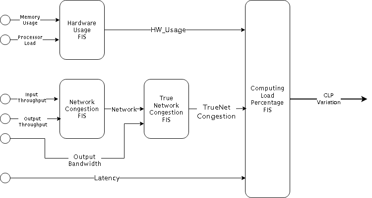
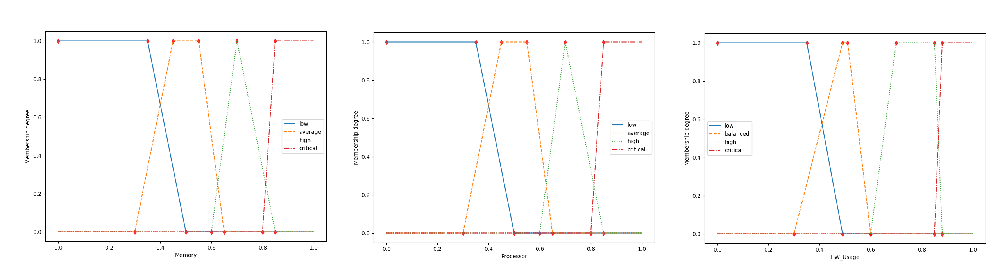
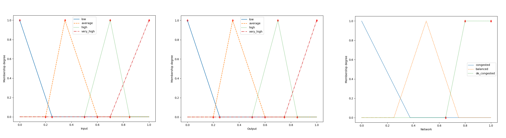
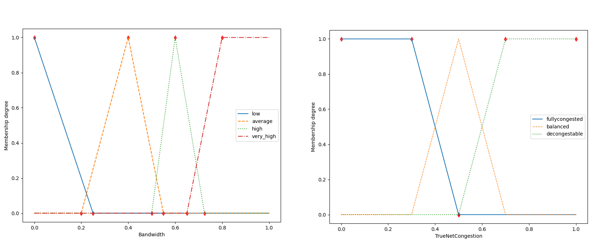
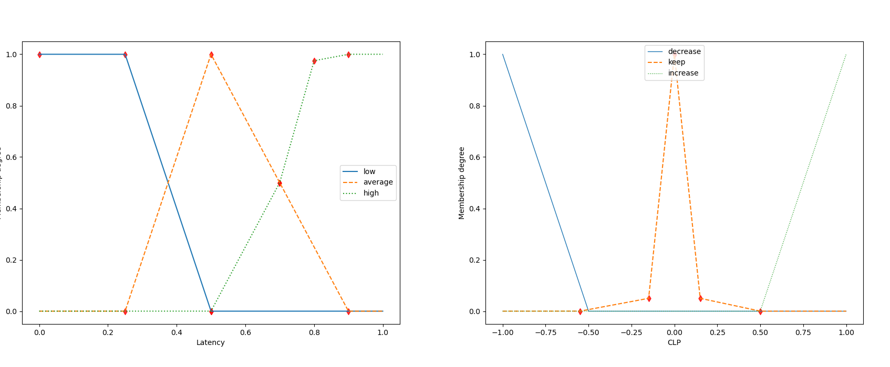
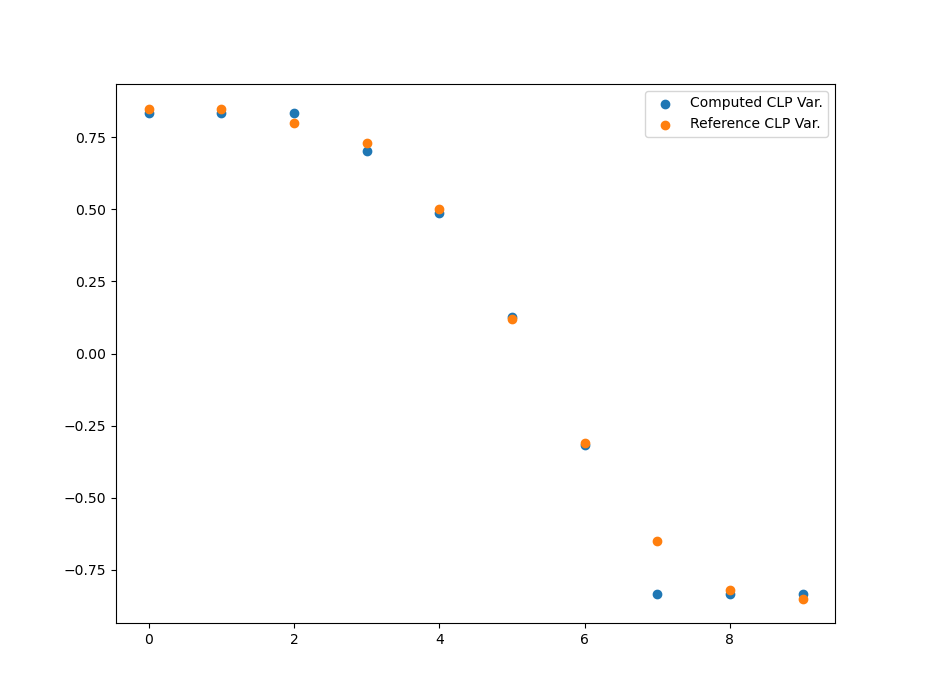

## Fuzzy System

### General Architecture

{width=85%}

From the 12 given variables we opted to only kept the 6 non-variations, since a Fuzzy System with 6 inputs will be smaller (and therefore simpler to fine-tune and write rules for) and the variations give no absolute current information which is the basis for our decision system.

Similiar to the idea of Comb's method, we broke our FIS (Fuzzy Inference System) into smaller, 2 to 3 input FISs. This allowed to have some granularity in their input and output membership sets without the risk of exploding. Our Architecture is composed 4 FIS.

\pagebreak

### Hardware Usage FIS

This system aggregates the hardware-related inputs: **Memory Usage** and **Processor Load**
Our rules set is fairly simple, having a 4 linguistic term granularity for inputs and output

|   |  **Memory**  |          | **Processor** | **Load** |              |
|---|:------------:|:--------:|:-------------:|:--------:|:------------:|
|   |              | **Low**  |  **Average**  | **High** | **Critical** |
|   |   **Low**    |   Low    |      Low      |   Low    |   Critical   |
|   | **Average ** |   Low    |   Balanced    | Balanced |   Critical   |
|   |   **High**   |   Low    |   Balanced    |   High   |   Critical   |
|   | **Critical** | Critical |   Critical    | Critical |   Critical   |

And so are the membership function for this FIS, following the Project guidelines and common sense

{}

\pagebreak

### Network Congestion FIS

This system outputs a "quantitative" network congestion value, based on the I/O throughput of a network.
Has with the last FIS both inputs have a granularity of 4 linguistic terms, however the output has only 3, since this seemed granular enough and simplified our FIS.
{}

|   | **Input Th.** |              |  **Output**  |   **Th.**    |               |
|---|:-------------:|:------------:|:------------:|:------------:|:-------------:|
|   |               |   **Low**    | **Average**  |   **High**   | **Very High** |
|   |    **Low**    | Decongested | Decongested | Decongested | Decongested  |
|   | **Average **  |     Congested      |   Balanced   | Decongested | Decongested  |
|   |   **High**    |     Congested      |  Congested   |     High     | Decongested  |
|   | **Very High** |     Congested      |  Congested   |   Balanced   |   Balanced    |

\pagebreak

### True Network Congestion FIS

Different from the last FIS the output of this System is not as much a "quantitative" variable as it is an indicative of an action to be taken.
This FIS combined the previously produced output with the Output Bandwidth variable, in order to determine if the Network is too congested for data forwarding (Fully Congested) and therefore should prioritize local data processing, able to be de-congested if data forwarding is prioritized  or if it is overall balanced and does not require further action. 

{}

|   | **Out. Bandwidth** |                 | **Previous Calculated Net.** |                 |
|---|:------------------:|:---------------:|:----------------------------:|:---------------:|
|   |                    |  **Congested**  |         **Balanced**         | **DeCongested** |
|   |      **Low**       | F. Congested |       F.  Congested       | F. Congested |
|   |    **Average **    | F. Congested |           Balanced           |    Balanced     |
|   |      **High**      | F. Congested |           Balanced           |    Balanced     |
|   |   **Very High**    |   DeCongest.    |          DeCongest.          |    Balanced     |

\pagebreak

### Final CLP FIS

Since this System takes 3 inputs we reduced the Latency granularity to 3 linguistic terms, so to simplify the rule set. 
As such the system-exclusive variables membership function is as presented below:

{width=125%}

Note that the high Latency membership has a sharper growth above 0.8 ms, since this is was taken as a stong indicative of a very poor network connection.

The membership function for the linguistic variable "keep" of the CLP output variable was decided to be made extemely fine, this was made so to pull "keep" cases to 0 the most.

\pagebreak
The rule set for the final FIS is slightly more complex. By fixing the Latency variable we can obtain the rule set tables.
For a **Low Latency** value:

|   | **HW Usage** |                     | **True Net. Congestion** |                   |
|---|:------------:|:-------------------:|:------------------------:|:-----------------:|
|   |              |  **F. Congested**   |       **Balanced**       |  **DeCongest.**   |
|   |   **Low**    |      Increase       |         Increase         |     Increase      |
|   | **Balanced** |   Increase   |      Keep/Increase       |       Keep        |
|   |   **High**   |   Increase   |         Decrease         |     Decrease      |
|   | **Critical** |      Decrease       |         Decrease         |     Decrease      |

For a **Average Latency** value:

|   | **HW Usage** |                     | **True Net. Congestion** |                   |
|---|:------------:|:-------------------:|:------------------------:|:-----------------:|
|   |              | **F. Congested** |       **Balanced**       | **DeCongest.** |
|   |   **Low**    |      Increase       |         Increase         |     Increase      |
|   | **Balanced** |      Increase       |      Keep/Increase       |       Keep        |
|   |   **High**   |      Increase       |           Keep           |     Decrease      |
|   | **Critical** |      Decrease       |         Decrease         |     Decrease      |

For a **High Latency** value:

|   | **HW Usage** |                     | **True Net. Congestion** |                   |
|---|:------------:|:-------------------:|:------------------------:|:-----------------:|
|   |              | **F. Congested** |       **Balanced**       |   **DeCongest.**   |
|   |   **Low**    |      Increase       |         Increase         |     Increase      |
|   | **Balanced** |      Increase       |         Increase         |     Increase      |
|   |   **High**   |      Increase       |         Increase         |     Increase      |
|   | **Critical** |      Decrease       |         Decrease         |     Decrease      |

The primary rule is the hardware protection-rule, since avoiding malfunctions/crashing on the Edge device and security of the network are our priorities - If the Hardware has reached criticality the CLP must be decreased.

Another rule obviosuly-prioritized is that when the Hardware Usage is Low or the Network is Fully congested (i.e. very difficult to de-congest) the CLP must be increased(except of course when conflicting with the first rule)

Another clear rule is that when latency is considered too high, priority is given to local data processing (which should translate into a CLP increase), once again exception is given when conflicting with rule number one.

\pagebreak

### Performance Metrics and Final Comments

| Computed CLP Variation | Tabled CLP Variation | Error |
|:----------------------:|:--------------------:|:-----:|
|        0.834000        |         0.85         | 0.016 |
|        0.834000        |         0.85         | 0.016 |
|        0.834000        |         0.80         | 0.034 |
|        0.700957        |         0.73         | 0.029 |
|        0.487149        |         0.50         | 0.013 |
|        0.265243        |         0.12         | 0.145 |
|       -0.316886        |        -0.31         | 0.007 |
|       -0.834000        |        -0.65         | 0.184 |
|       -0.834000        |        -0.82         | 0.014 |
|       -0.834000        |        -0.85         | 0.016 |

Our fuzzy system solution has a MSE (Mean Squared Error) of **0.0058** , which indicates a seemingly strong performance for the provided dataset.
The comparison between the computed Computing Load Percentage variation (CLPv) and the given reference can be observed below.

{width=85%}

The major problem identified in our FIS solution is related to softer transitions - due to our hard limits related to low or critical Hardware Usage, predicted softer CLP transitions are sharper in our solution having less granularity in for greater CLP Increases and Decreases.

\newpage

## Neural Network

To build our neural network model, we started by generating a random dataset with 10,000 rows. This dataset was processed using the Fuzzy System, which provided the input features for the neural network. After observing the dataset, we notice that the dataset was imbalenced there were a lot more values between (0.34,1) then (-0.33,0.33). So to balenced it out, we duplicated the entries of the values between (-0.33,0.33). 

The dataset was then split into three subsets: 70% of the data was allocated for training, 15% for validation, and the remaining 15% for testing. The training set was used to train the neural network through cross-validation, ensuring that the model generalized well across different splits of the data. After completing cross-validation, we used the validation set to fine-tune and identify the optimal hyperparameters for the neural network. Finally, we evaluated the model's performance on the test set to assess its final predictive accuracy.

Them we define a threshold to classify the regression output into 3 classes: Increase (0.34,1) , Maintain (-0.33,0.33) and Decrease (-1, -0.34).

### Architecture

The final neural network model consisted of six input features and two hidden layers. The first hidden layer contained 8 neurons, while the second hidden layer consisted of 5 neurons. We selected the logistic function as the activation tanh. The solver used for optimizing the network was the lbfgs algorithm.

This configuration of the neural network was chosen based on the best performance observed during the validation phase, ensuring that the final model achieved a strong balance between accuracy and generalization. We then tested this model on the test set to evaluate its real-world performance.

### Performance Metrics

We analyze the performance of the neural network model in predicting both regression and classification outcomes using a dataset with a highly imbalanced distribution. To evaluate the model's ability to generalize and accurately predict both numerical values (for regression) and class labels (for classification), we used the following metrics accuracy, mean squared error (MSE), and confusion matrix.

| Training Accuracy |  0.98  |
|    Training MSE   | 0.0085 |
|   Test Accuracy   |  0.96  |
|      Test MSE     | 0.0154 |

The model achieved a training accuracy of 98% and a training MSE of 0.0085. These metrics indicate a strong fit to the training data, with the low MSE reflecting a high degree of precision in numerical predictions. However, the high accuracy may be influenced by the high frequency of "Increase" class, which is heavily represented in the dataset. 

On the test set, the model achieved a test accuracy of 96% and a test MSE of 0.0154. The test MSE is slightly higher than the training MSE, which is expected and suggests that the model generalizes well to unseen data. Despite the imbalanced test set, the model was able to maintain high accuracy and relatively low MSE, reflecting good generalization from the training data. 

| Actual / Predicted | Decrease | Increase | Maitain |
|:------------------:|:--------:|----------|---------|
|      Decrease      |    443   |     3    |    18    |
|      Increase      |     2    |   2520   |    18    |
|      Maintain      |     0    |     20    |   261   |

|          | Precision | Recall | F1 score |
|:--------:|:---------:|--------|----------|
| Decrease |    1.00   |  0.96  |   0.97   |
| Increase |    0.99   |  0.99  |   0.99   |
| Maintain |    0.88   |  0.93  |   0.90   |

Analyzing the confusion matrix and the precision,recall and f1 score metrics, we can conclude that the model performed well in classifying the classes. The Increase class achieved the highest score, largely due to the higher representation of this class in the dataset. The Maintain class, despite being artificially increased showed a relatively strong performance. However,its scores were still slightly lower compared to the other classes, likely due to its relatively smaller number of instances.
Overall, the model demonstrated strong classification performance across all classes

| CLPVariation | Fuzzy CLPVariation | NN CLPVariation | Fuzzy Class | NN Class |
|:------------:|:------------------:|:---------------:|-------------|----------|
|     0.85     |        0.83        |       0.83      |   Increase  | Increase |
|     0.85     |        0.83        |       0.84      |   Increase  | Increase |
|      0.8     |        0.83        |       0.78      |   Increase  | Increase |
|     0.73     |        0.70        |       0.73      |   Increase  | Increase |
|      0.5     |        0.49        |       0.82      |   Increase  | Increase |
|     0.12     |        0.27        |       0.19      |   Maintain  |  Mantain |
|     -0.31    |        -0.32       |      -0.55      |   Mantain   | Decrease |
|     -0.65    |        -0.83       |      -0.61      |   Decrease  | Decrease |
|     -0.82    |        -0.83       |      -0.83      |   Decrease  | Decrease |
|     -0.85    |        -0.83       |      -0.84      |   Decrease  | Decrease |

When applying the original dataset, we observed a mean squared error (MSE) of 0.016, which is slightly higher than the MSE obtained with the neural network model. This increase in MSE could be attributed to the errors introduced by the Fuzzy System during the generation of the random dataset used for training the neural network. Any inaccuracies in the Fuzzy model might propagate through to the neural network, affecting its training and, consequently, the final predictions.

## Conclusions
